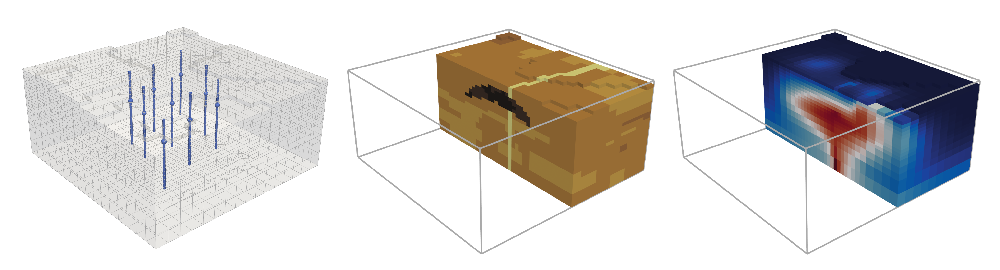

# Ensemble Kalman Inversion for Geothermal Reservoir Modelling



This repository contains code for the synthetic case studies used as part of the paper "Ensemble Kalman Inversion for Geothermal Reservoir Modelling", by Alex de Beer, Elvar K. Bjarkason, Michael Gravatt, Ruanui Nicholson, John P. O'Sullivan, Michael J. O'Sullivan, and Oliver J. Maclaren. 
Ensemble Kalman inversion (EKI; [[1](#1), [2](#2)]) is a derivative-free algorithm that iteratively update a set of interacting particles to produce an approximation to the posterior distribution of the model parameters. 

## Citation

*Coming soon.*

## Getting Started

To run the code in this repository on a local machine, first install Python >= 3.8. Then, clone the repository and install the project dependencies using

```
pip install -r requirements.txt
```

### Simulations

You will need to install Waiwera to simuate each model. For information on getting started with Waiwera, consult the Waiwera [website](https://waiwera.github.io/install/).

To run EKI on each model, use the scripts in the top level of the repository (adjusting the algorithm parameters where appropriate).

### Plotting

To reproduce the plots in the main body of the paper, run the `plot_slice.py` (vertical slice model) or `plot_fault.py` (three-dimensional model) scripts in the top level of the repository. 
To reproduce the plots in the supplementary material, run `plot_slice_supplement.py` or `plot_fault_supplement.py`.

## Issues

If you have any questions about the code or the content of the paper, please email [adeb970@aucklanduni.ac.nz](mailto:adeb970@aucklanduni.ac.nz), or open an [issue](https://github.com/alexgdebeer/GeothermalEnsembleMethods/issues).

## References

[<a id="1">1</a>]
Iglesias, MA, Law, KJ, and Stuart, AM (2013).
Ensemble Kalman methods for inverse problems.
*Inverse Problems* **29**, 045001.

[<a id="2">2</a>]
Iglesias, M and Yang, Y (2021). 
Adaptive regularisation for ensemble Kalman inversion.
*Inverse Problems* **37**, 025008.